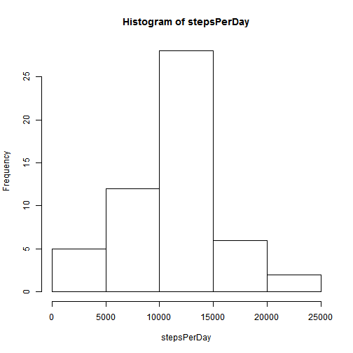
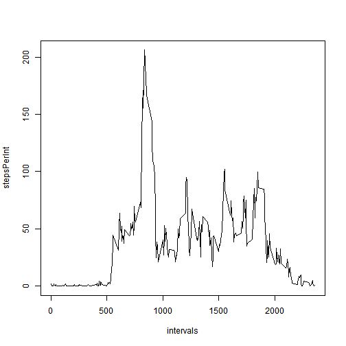
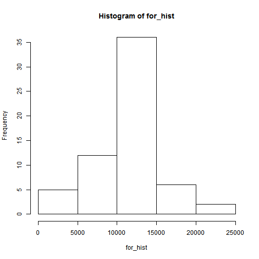
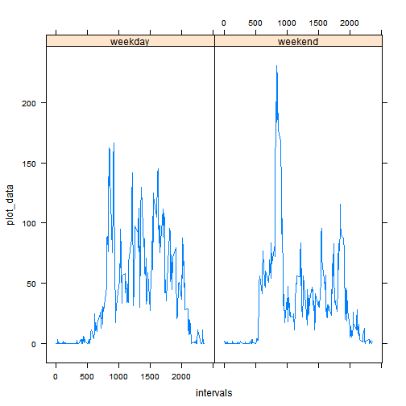

# Reproducible Research: Peer Assessment 1


## Loading and preprocessing the data

The data file called "activity.csv" was downloaded from the course website, saved
in the local repository, and then called into RStudio using the following code:


```r
data <- read.csv("activity.csv",stringsAsFactors=T)
```
The "Date" column was imported as a Factor to make plotting and computation 
easier.

## What is mean total number of steps taken per day?

Next, total steps per day were calculated using:

```r
stepsPerDay <- as.numeric(tapply(data$steps,data$date,sum,simplify=F))
```
The data was converted to numeric so that summaries could be obtained on it.
Then a histogram of stepsPerDay, and mean and median of the data were calculated
as below:

```r
hist(stepsPerDay)
```

 

```r
mean(stepsPerDay,na.rm=T)
```

```
## [1] 10766
```

```r
median(stepsPerDay,na.rm=T)
```

```
## [1] 10765
```
Note: Removing NAs was necessary to compute the summaries.


## What is the average daily activity pattern?

First, interval names are extracted from the original data file. Then, mean number
of steps are calculated for these intervals across ALL DAYS and plotted using a
time series plot as below:

```r
intervals <- data[1:288,3]
stepsPerInt <- as.numeric(tapply(data$steps,as.factor(data$interval),mean,simplify=F,na.rm=TRUE))
plot(intervals,stepsPerInt,type="l")
```

 

Then, a data frame is created for the intervals and their avg. total steps. It is used to extract the particular interval that has the max avg. number of steps
across all days:

```r
frame = data.frame(intervals,stepsPerInt)
frame[frame$stepsPerInt==max(stepsPerInt),1]
```

```
## [1] 835
```

## Imputing missing values


The following shows the total number of missing values in the original dataset:

```r
nrow(data) - nrow(data[complete.cases(data),])
```

```
## [1] 2304
```
The author decided to fill in these values by using the means of the intervals
across all days. The following loop goes through all the rows of the dataset and
after spotting an NA, it looks in the "frame" data frame for that interval, looks
for its mean, and then fills the NA with the mean:

```r
newData = data
for (i in seq(nrow(newData))) {
    if (is.na(newData[i,1])) {
        interval = newData[i,3]
        itsMean = frame[frame$intervals==interval,2]
        newData[i,1] = itsMean
    }
}
```

Now, the "newData" dataset, where NAs have been filled, was used to plot a histogram and report summaries:

```r
for_hist <- as.numeric(tapply(newData$steps,newData$date,sum,simplify=F))
hist(for_hist)
```

 

```r
mean(for_hist)
```

```
## [1] 10766
```

```r
median(for_hist)
```

```
## [1] 10766
```
The histogram mostly looks similar, except that the frequency for the number of
steps in the middle has increased. The mean value is exactly same, however, the median has changed and has become equal to the mean. 

## Are there differences in activity patterns between weekdays and weekends?

First, the "Date" column in the "newData" dataset is converted to Date class and then a new column is introduced to create a new dataset called "final_data". The new column is called "typeOfDay". A loop is used to go through all the rows of "newData" and see which day of the week it is. If it is a weekend, then "weekend" is entered into "typeOfDay" column. Otherwise, "weekday" is entered. 


```r
newData[,2]=as.Date(newData[,2])
typeOfDay = vector()
for (i in seq(nrow(newData))) {
    day = weekdays(newData[i,2])
    if (day=="Saturday" | day=="Sunday"){
      dayType = "weekday"
    } else dayType = "weekend" 
    typeOfDay = rbind(typeOfDay,dayType)  
}
typeOfDay = as.factor(typeOfDay)
final_data = data.frame(newData,typeOfDay)
```
Then, two subsets of "final_data" are extracted based 


```r
# weekday_data will be data for weekdays
weekday_data = final_data[final_data$typeOfDay=="weekday",]
# weekend_data will be data for weekends
weekend_data = final_data[final_data$typeOfDay=="weekend",]
```

Next, a panel plot is generated using base plotting system for mean number of 
steps vs. intervals on weekdays and weekends:


```r
plot_weekday <- as.numeric(tapply(weekday_data$steps,as.factor(weekday_data$interval),mean,simplify=F))


plot_weekend <- as.numeric(tapply(weekend_data$steps,as.factor(weekend_data$interval),mean,simplify=F))

plot_data = cbind(plot_weekday,plot_weekend)
dayType = factor()
for (i in seq(length(plot_weekday)))     dayType = rbind(dayType,"weekday")
for (i in seq(length(plot_weekend)))    dayType = rbind(dayType,"weekend")

intervals = c(intervals,intervals)
panel_plot_data = data.frame(plot_data,intervals,dayType)
library(lattice)
xyplot(plot_data ~ intervals | dayType , data=panel_plot_data, type ="l")
```

 
